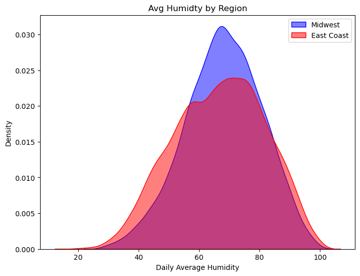
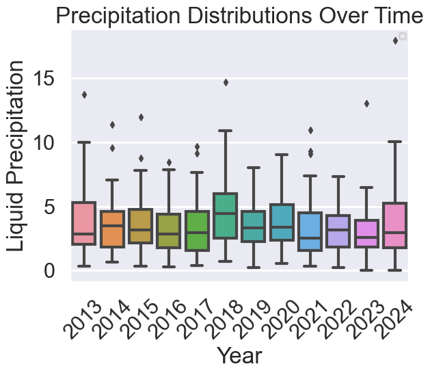

# Climate Data Project

## Table of Contents:
- [Climate Data Project](#climate-data-project)
  - [Table of Contents:](#table-of-contents)
  - [Introduction](#introduction)
  - [Methodology](#methodology)
  - [Analysis and Findings](#analysis-and-findings)
    - [Temperature](#temperature)
    - [Humidity](#humidity)
    - [Precipitation](#precipitation)
  - [Discussion](#discussion)
  - [Conclusion](#conclusion)

## Introduction

Climate science has definitively proven that global temperatures have drastically increased relative to past decades. Higher global temperatures have implications for many climatological phenomena, and increase the frequency and desctructiveness of natural disasters like storms, floods, droughts, and wildfires. In my hometown of Washington D.C., I've always known hot summer seasons, however in the past ten years I've noticed that all our seasons have felt extraordinarily warmer. Summer storms have also become more intense, with seemingly heavier rains and more frequent flooding. This project seeks to explore some the impacts of climate change; specifically how fluctuations in temperature impact humidity, precipitation, and the relationship between those two variables. 

[Research](https://www.metoffice.gov.uk/about-us/news-and-media/media-centre/weather-and-climate-news/2020/scientists-investigate-humidity---the-second-pillar-of-climate-change) has shown how rising temperatures influence shifts in the saturation of water vapor in the air, which in turn increases the liklihood of heavier raindfall incidents. I hypothesize that my analysis will show first that temperatures have increased increased in recent years, leading to higher humidity readings and increased precipitation.

Here is the [link to the Github repository](https://github.com/griffinberonio/Climate_Data_Project) for this project.

## Methodology

This study examines ten-year periods from five total weather stations across two separate regions: the Midwest and the East Coast. Weather data comes from weather stations at five major airports: Asheville Regional Airport (ARA) in Ashevill North Carolina, Reagan National (DCA) in Washington D.C. JFK Airport (JFK) in New York City, Minneapolis-Saint Paul (MSP) in Minneapolis, Minnesota, and Dane County Regional (MSN) in Madison, Wisconsin. I first examined fluctuations in temperature averages and maximums using wetbulb temperature data for each station. I also compared temperature trends between the two regions, and analyzed departures from normal temperatures. Next, I looked at fluctuations in humidity between locations and regions, using daily humidity averages from the data. Finally, I looked at precipitation totals, averages, and maximums across time and locations, and examined relationships between humidity and rainfall. 

## Analysis and Findings

### Temperature

|  |
|:--:|
| Temperature Averages by Location |

This graph plots annual maximum temperatures for each location in the study. Unsurprisingly, the Washington D.C.-based weather station at DCA airport shows a significantly higher temperature baseline. DCA's maximum temperatures tend to be even higher than those from the Asheville airport (ARA), which is much further south. The overall trends in maximum temperatures for all locations indicates a gradual increase over time, which is consistent with my hypothesis. 

* *Temperature Averages by Region*

This graph highlights differences in average temperatures by region between the Midwest and the East Coast. The East Coast shows significantly higher average temperatures, and this graph also re-emphasizes upward trends in average temperatures over time. Colder winters and relatively cooler summer seasons in the Midwestern locations likely bring down their averages in comparison to the Coastal stations. 

* *Regional Departures from Normal Temperature Trends*

As temperatures rise across the globe, temperature measurements have begun to show departures from typical readings with higher positive magnitudes. This graph highlights this trend, as we can see a notable increase in average departures from normal maximum temperatures across the data's timespan. 

### Humidity

* *Locational Changes in Humidity (Using Daily Averages)*

Our humidity averages graph shows a lot a variation in trends between each location. This graph examines maximimum daily averages in humidity across each year for each location. It appears that between 2013 and 2018, variation in yearly humidity averages moved slightly more cohesively between the locations, however these trends seem to diverge significantly into the 2020s. The later half of the timeframe shows most locations reaching peaks in their humidity averages, especially around 2020, where many of them reached maximum daily averages of near 100 percent humidity. 
* *Regional Humidity Densities*

The Midwest and the East Coast have significant differences in their general climate characterisitcs, thus their humidity distributions likely feature significant differences. The coastal region, being in closer proximity to the ocean, is subject to its heating and cooling effects, which cause a wider range of fluctuations in humidity. The graph reflects this differnce in humidity thresholds between the regions in the wider distribution of humidity averages for the East Coast region relative to the Midwest. 

### Precipitation

* *Precipitation Averages by Location (Time)*

* *Precipitation Averages by Location (Liquid Volume)*

* The first graph above highlights differences in average annual precipitation for each location, when measuring precipitation duration. We can see that the Asheville area has much higher durations for precipitations, which makes sense given its southern climate. We can also see in the first graph that the Midwestern locations in Madison and Minneapolis fall toward the bottom of the stack, potentially due to their more restricted humidity distribution. 
* The second Graph examines the precipitation differences between the regions more specifically, this time using precipitation liquid volume as the variable of interest. It highlights the rift between the two regions, with the East Coast seeing generally higher rates of annual precipitation. The final year of the timeframe indicates a convergence in precipitation trends for the regions, although we explore potential reasons for this in the next analysis. 
 
* *Annual Precipitation Boxplots* 

These boxplots take into account the overall trends for annual liquid precipitation across all locations. Although the distributions for the overall liquid volume precipitation trends per year do not fluctuate drastically, I did notice a specifically distant outlier in the last year, which may have contributed to the convergence seen in the previous analysis. 

* *Departures from Normal Precipitation Trends*

Relative to the temperature graphs from the first section, fluctuations in average departures from normal precipitation trends are follow less of an obvious pattern. Although the trend is not immediately clear, it seems like after an especially scattered year of average departures around the year 2018, the variation in these deviations seems to increase. This increase in variation follows a trend comparable to that of the humidity averages we analyzed in the previous section. 

* *Relationship Between Humidity and Precipitation*

Using an linear model plot, I examined the relationship between annual precipitation averages and humidity averages. This graph indicates a strong positive relationship between these variables, which aligns with my initial hypothesis. This analysis incorporated average precipitation in liquid volume, and daily relative humidity averages. 

## Discussion

Humidity is sometimes referred to as the "second pillar of climate change", due to it's influence over many impactful climate dynamics. As we explored in this study, humidity can play a significant role in influencing precipitation frequency and volume. Higher relative humidity percentages can increase the liklihood of extreme rainstorms, which may cause flooding or dangerous levels of erosion. Hightened  humidity also contributes to more intense heatwaves, which are often a direct cause of climate-related fatalities. Our exploration of the data showed how temperatures have steadily increased in our chosen locations, with significant differences across regions. The anaysis also indicated that variation in humidity levels has increased year-to-year, which had implications for precipitation records in both regions. The culmination of our data-exploration was establishing the relationship between hunidity and precipitation, which we showed was positive and significant.  

## Conclusion

Variability in humidity is crucial to monitor, to gain a more thorough understanding of how climate change has impacted the saturation of water vapor in the air, and inform meteorological forecasting for preecipitation and ground temperatures. By aggregating climate data from across the country, we can examine presisitent trends, and better understand how climate change will continue to shape our world. 
